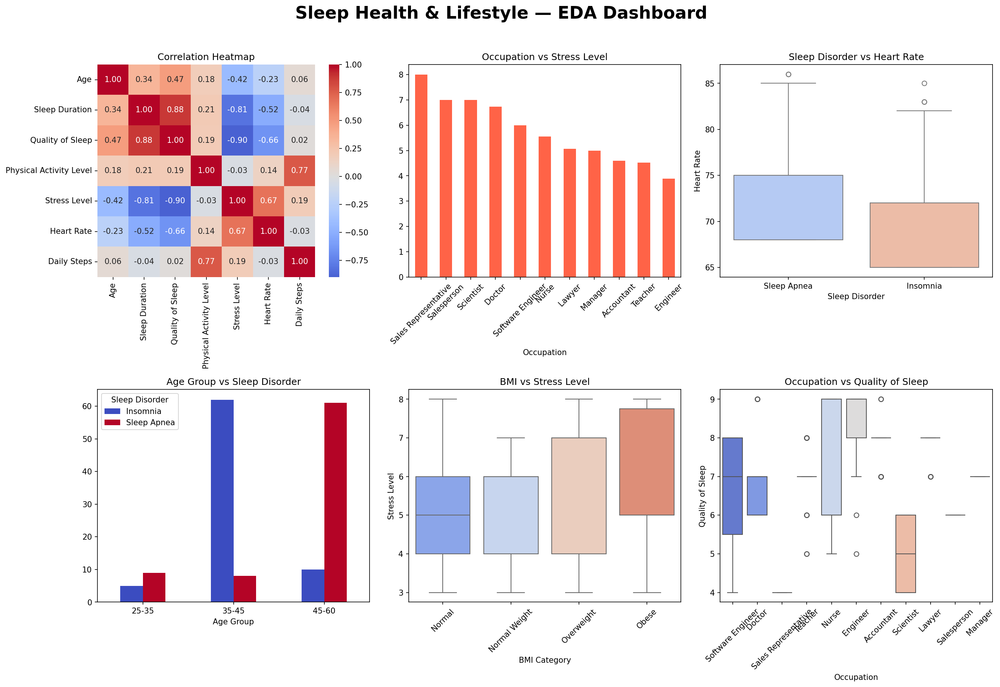
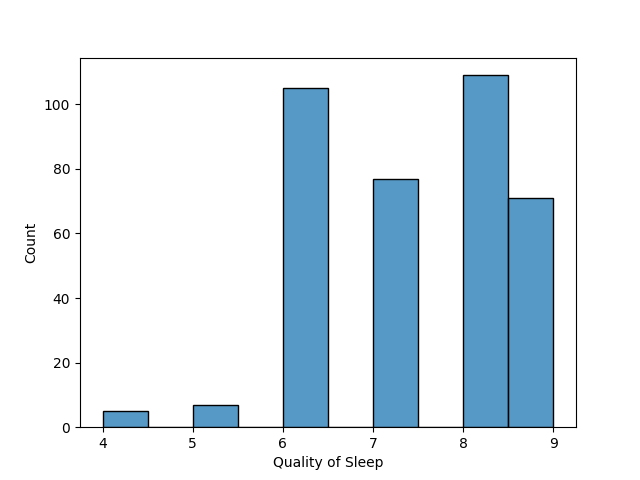
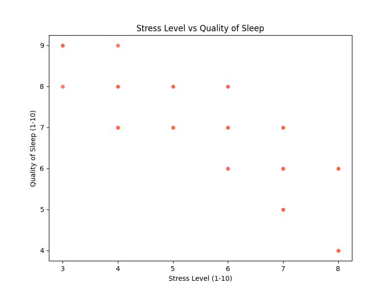
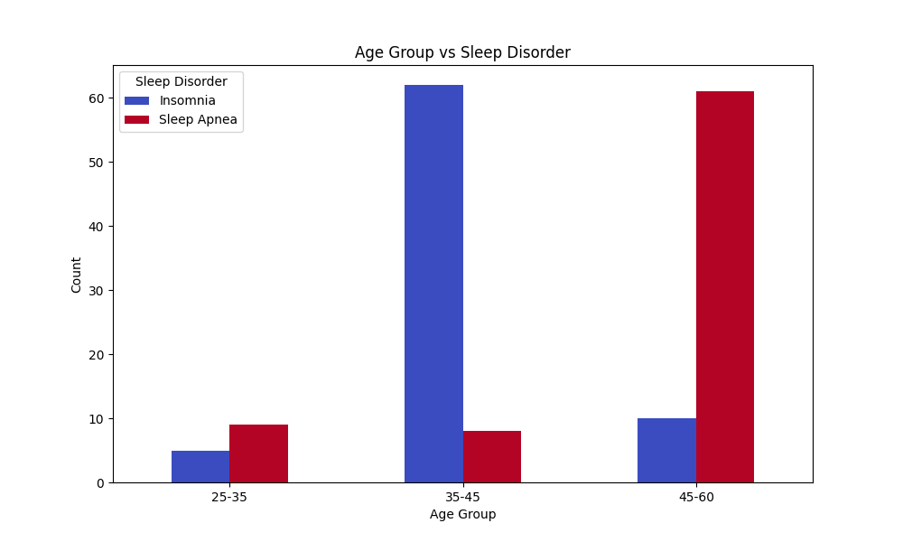
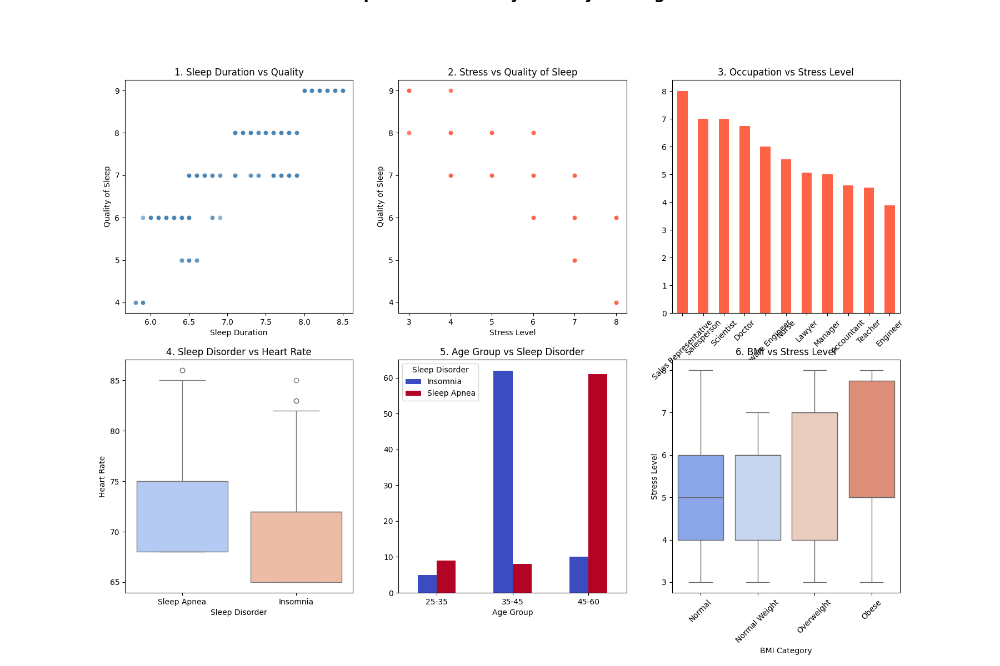

# Sleep health and lifestyle Analysis

This project analyzes sleep health and lifestyle patterns 
across 374 individuals. The goal is to uncover what factors 
most influence sleep quality, stress levels, and sleep disorders 
using Python-based exploratory data analysis.

## Overview #
End-to-end Exploratory Data Analysis on a sleep health 
and lifestyle dataset exploring relationships between 
sleep quality, stress, BMI, occupation, and sleep disorders.

## Analysis Walkthrough
### 1. Univariate Analysis

> Quality of Sleep shows a **bimodal distribution** 
> with peaks at score 6 and 8 — suggesting two 
> distinct groups of sleepers in the dataset.

### 2. Correlation Heatmap

> **Stress Level** has the strongest negative correlation 
> with Sleep Quality (r = -0.90) while **Sleep Duration** 
> has the strongest positive correlation (r = 0.88).

### 3. Sleep Duration & Stress vs Quality 
     
> Clear upward trend — more sleep duration directly 
> leads to better sleep quality with no outliers.
> Clear downward trend — higher stress directly 
> leads to worse sleep quality with no outliers.

### 4. Age Group vs Sleep Disorder

> Insomnia peaks in middle age (35-45) likely due to 
> work stress while Sleep Apnea dominates in older 
> age (45-60) due to physical changes.

### 6. Final Summary Dashboard

## Key Findings
| Finding | Detail |
|---|---|
| Strongest negative correlation | Stress vs Sleep Quality (r = -0.90) |
| Strongest positive correlation | Sleep Duration vs Sleep Quality (r = 0.88) |
| Most stressed occupation | Sales Representative (9.0/10) |
| Least stressed occupation | Engineer (4.0/10) |
| Most sleep disorders | Overweight group |
| Insomnia peaks | Age 35-45 |
| Sleep Apnea peaks | Age 45-60 |

---
## Tools Used
- Python
- Pandas
- Seaborn
- Matplotlib
- Jupyter Notebook

---
##  How to Run
1. Clone the repo
git clone https://github.com/suzzzel5/Sleep-health-and-lifestyle-

2. Install dependencies
pip install pandas seaborn matplotlib